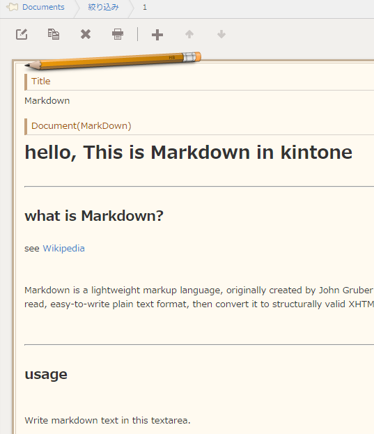

kintoneMarkdown
==================

kintoneのテキストフィールドで[Markdown記法](https://help.github.com/articles/markdown-basics/)が使えるようにするサンプルです。  
このスクリプトの前に、Markdown記法を解釈するための[marked](https://github.com/chjj/marked)を読み込ませておく必要があります。  
markedをダウンロードしてkintoneにアップロードするか、[CDNに上げられているもの](https://cdnjs.cloudflare.com/ajax/libs/marked/0.3.2/marked.min.js)を利用してください。  



```js
/*
 * markdown
 * (It requires to load marked.min.js)
 * Licensed under the MIT License
 */
(function() {
    "use strict";
    
    var showEvents = ["app.record.detail.show"];

    //Show preview to 
    kintone.events.on(showEvents, function(event){
        var record = event.record;
        var doc = kintone.app.record.getFieldElement("document");
        doc.innerHTML = marked(record["document"].value);
    });
    
})();
```
